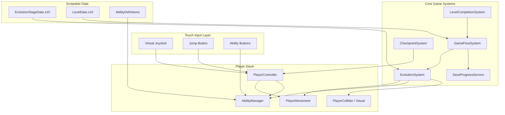

# From Cell: Evolution Run — Complete Unity 2D Architecture

A mobile-first, level-based platformer where **evolution is the central gameplay modifier**. Every system reads from data, not hardcoded level logic. The player is always one prefab; stages change feel through configuration.

---

## 1. Design Pillars

| Pillar | Rule |
|--------|------|
| **Evolution drives feel** | Movement, abilities, collider size, and camera behavior come from `EvolutionStageData`, not per-level scripts |
| **Data over hardcoding** | Levels define layout and hazards; they never branch on "if level 7" |
| **One-thumb mobile** | Left virtual stick, right jump (and contextual ability buttons when unlocked) |
| **Fast failure loop** | Death → instant respawn at checkpoint; no loading screens mid-level |
| **Short sessions** | 10 levels × 2–5 min = ~30–45 min full playthrough |
| **Indie scope** | Reuse tilesets, hazard prefabs, and UI; differentiate via stage params and level layout |

---

## 2. High-Level System Map



**Dependency rule:** Input → PlayerController → Movement + Abilities. EvolutionSystem is the single authority for "what the player can do right now." GameFlowSystem owns scene/state transitions. Levels only emit events (goal reached, hazard hit, collectible picked).

---

## 3. Core Systems — Detailed Breakdown

### 3.1 Player Movement System

**Responsibility:** Physics-based 2D locomotion with stage-variable parameters.

**Components:**
- `PlayerController` — orchestrates input, grounded state, ability gates, animation triggers
- `PlayerMovement` — applies forces/velocity caps, coyote time, jump buffering
- `GroundChecker` — raycast/overlap for floor detection
- `PlayerVisual` — sprite swap, scale, optional procedural "growth" during Embryo level

**Movement model:**
- `Rigidbody2D` with interpolation on, rotation frozen
- Horizontal: acceleration toward target speed
- Vertical: impulse jump + gravity scale per stage
- Air control multiplier per stage (Teen = high speed, lower air control)

**Per-stage parameters (from `EvolutionStageData`):**

| Parameter | Purpose |
|-----------|---------|
| `moveSpeed` | Max horizontal speed |
| `acceleration` | Touch responsiveness |
| `jumpForce` | Single jump strength |
| `gravityScale` | Floaty cell vs heavy human |
| `airControl` | 0–1 multiplier mid-air |
| `colliderSize` | Hitbox scales with evolution |
| `canJump` | false for Cell stages |
| `movementMode` | Float / Crawl / Walk enum |

**Movement modes:**
- **Float** (Levels 1–3): Reduced gravity, drift on release, no jump
- **Crawl** (Level 4–5): Low profile collider, weak hop
- **Walk** (Level 6+): Standard platformer feel

### 3.2 Touch Control System

**Components:**
- `TouchInputManager` — singleton, exposes MoveAxis, JumpPressed, DashPressed
- `Joystick` — dead zone, drag handling
- `JumpButton` / `DashButton` — UI button hooks
- `InputGate` — disables input during cutscenes, evolution overlay, pause

### 3.3 Evolution System

**Components:**
- `EvolutionSystem` — CurrentStageIndex, ApplyStage(), AdvanceStage()
- `EvolutionStageData` (ScriptableObject) — one asset per biological stage
- `EvolutionPresenter` — UI overlay, humor lines

**Stage order:** Cell → Cluster → Organism → Primitive → Embryo → Nervous → Newborn → Child → Teen → Adult

### 3.4 Ability System

| Ability ID | Unlocked At | Behavior |
|------------|-------------|----------|
| `Move` | Always | Horizontal locomotion |
| `Jump` | Primitive+ | Standard jump |
| `DoubleJump` | Child | Second impulse in air |
| `Dash` | Teen | Short horizontal burst |
| `Float` | Cell–Organism | Slow fall / drift |

### 3.5 Game Flow System

States: Boot → MainMenu → LevelLoad → Playing → (Paused / PlayerDead / LevelComplete) → Evolution → next level or Credits

### 3.6 Level Completion System

- `FinishZone` — trigger collider
- `LevelCompletionSystem` — validates and raises LevelCompleted event
- Never call `SceneManager.LoadScene` directly from finish zone

### 3.7 Supporting Systems

CheckpointSystem, HazardSystem, CollectibleSystem, CameraSystem, AudioManager, SaveProgressService

---

## 4. Data Architecture

```
GameConfig (ScriptableObject)
├── EvolutionStages[10]  → EvolutionStageData
├── Levels[10]           → LevelData
└── AbilityCatalog       → AbilityDefinition[]
```

---

## 5. Level-by-Level Design

| Level | Stage | Key Mechanic |
|-------|-------|--------------|
| 1 | Cell | Float movement, no jump, nutrients |
| 2 | Cluster | Heavier float, division points |
| 3 | Organism | Role-switch pads, hazards |
| 4 | Primitive | Crawl + weak jump |
| 5 | Embryo | Growth pickups mid-level |
| 6 | Nervous | Precision walk platforming |
| 7 | Newborn | Full body platformer baseline |
| 8 | Child | Double jump |
| 9 | Teen | Dash |
| 10 | Adult | Full kit mastery gauntlet |

See full level design tables in project README setup section.

---

## 6. Unity Scene Structure

| Scene | Purpose |
|-------|---------|
| `_Boot` | Init services |
| `_MainMenu` | Title, continue |
| `Level_01_Cell` … `Level_10_Adult` | Gameplay |
| `_Credits` | End game |

---

## 7. Folder Architecture

```
Assets/_Project/
├── Scenes/
├── Prefabs/
├── ScriptableObjects/
├── Scripts/
│   ├── Core/
│   ├── Evolution/
│   ├── Player/
│   ├── Abilities/
│   ├── Input/
│   ├── Level/
│   └── UI/
├── Art/
└── Settings/
```

---

## 8. Development Order

1. **Phase 0** — Project foundation, layers, placeholder scene
2. **Phase 1** — Movement prototype (walk + jump)
3. **Phase 2** — Mobile input (joystick + buttons)
4. **Phase 3** — Evolution data + ApplyStage
5. **Phase 4** — Abilities (double jump, dash)
6. **Phase 5** — Game flow, checkpoints, finish zones
7. **Phase 6** — Evolution presentation UI
8. **Phase 7** — Level production (1→10)
9. **Phase 8** — Art, audio, polish
10. **Phase 9** — Android ship prep

---

## 9. Android / Play Store Checklist

- URP 2D Renderer
- IL2CPP, ARM64
- Landscape default
- 60 FPS target
- Checkpoint respawn < 0.5s perceived

---

## 10. Summary

1. Touch Input feeds PlayerController
2. EvolutionSystem configures PlayerMovement + AbilityManager from data
3. Abilities are modular; stages toggle them
4. Level scenes are geometry + LevelBootstrap + FinishZone
5. LevelCompletionSystem → GameFlowSystem → evolution → next scene
6. Checkpoints + Save keep mobile sessions frictionless

---

## 11. Known non-issues (verified, intentionally left alone)

`GameFlowSystem.LoadLevel(int index, bool applyStage)` calls `SceneManager.LoadScene(level.sceneName)`
*before* `evolutionSystem.ApplyStage(...)` runs. `SceneManager.LoadScene` is deferred to the
end of the current frame, so in practice the apply call lands on the outgoing scene's
`EvolutionSystem` right before it's destroyed — a no-op. This is harmless because
`LevelBootstrap.ApplyEvolution()` correctly re-applies the right stage in the new scene's
`Start()` once it loads. Confirmed via a standalone compile/verification pass (see
`unitycheck/` tooling referenced in project notes) — not fixed, since touching flow-control
ordering here has no behavioural upside and only adds risk.
